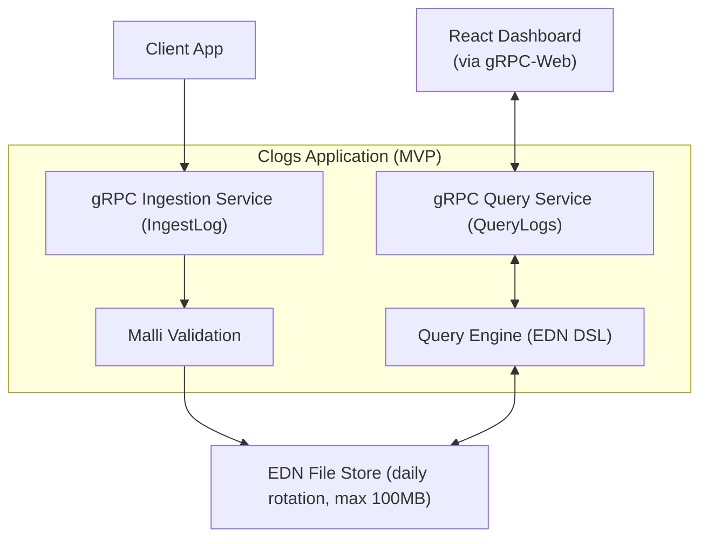
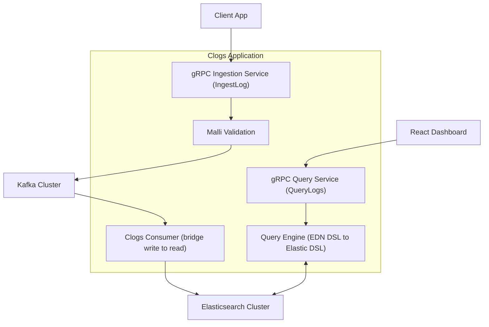

# Why Clojure?

Clogs is intentionally built in **Clojure** because it showcases the language’s unique strengths:

- **Data-First Queries**: Queries in Clogs are expressed as **EDN maps**. Translation to Elasticsearch DSL is just map transformations, which is idiomatic Clojure.
- **Readable and Concise**: A query like  
  ```clojure
  {:where {:level "error"} :group-by [:service] :aggregate {:count :*}}
  ```  
  is tiny, self-explanatory, and declarative — far clearer than verbose builder APIs in Java or Rust.
- **Validated by Malli**: Python and Ruby can represent queries as dicts/hashes, but they lack natural schema validation. With Malli, schemas are also **data**, validated at runtime. This gives **flexibility + correctness** in one.
- **No Comparable Alternative**:  
  - Java/C# → verbose, object-heavy, boilerplate.  
  - Go/Rust → safe but clunky for dynamic queries.  
  - Python/Ruby → concise but unsafe without bolted-on libs.  
  - **Clojure** → combines conciseness *and* correctness, making it the best choice.

👉 This makes *Clogs* a **perfect demonstration project**: it highlights how Clojure’s philosophy (data, immutability, schemas) is ideal for building systems where queries are both **dynamic and safe**.

---
# Architecture

## Identity
- **Name**: Clogs (Clojure Logs)
- **Tagline**: *“A data-first logging platform in Clojure.”*

---

## Core Concept
Clogs is a **mini logging platform** (inspired by Splunk/ELK) with a **data-first philosophy**.  
It ingests logs → validates them → stores them in a **write store** → projects them into a **read store** → allows queries via an **EDN DSL** → visualizes results in a **React dashboard**.

---

## Architecture Decisions

### 1. Ingestion
- **MVP**: HTTP endpoint `/logs` (simple and universal).
- **Phase 2**: Kafka ingestion (durable, high throughput, source of truth).
- **Future**: optional gRPC/UDP/agents.

### 2. Validation
- **Malli** is used for schema validation.
- Ensures structured logs before storage.
- Returns **human-friendly error messages** instead of stack traces.
- Schema example:
  ```clojure
  [:map
   [:timestamp inst?]
   [:level [:enum "info" "warn" "error" "debug"]]
   [:msg string?]
   [:service string?]
   [:context {:optional true} :map]]
  ```

### 3. Storage
#### Write Store
- **MVP**: EDN Files (newline-delimited EDN maps).
  - Strategy: 1 file per day, roll over when >100MB.
- **Final**: Kafka as the canonical write store (source of truth).

#### Read Store
- **MVP**: EDN file scanning (basic queries).
- **Final**: Elasticsearch for queries, aggregations, and full-text search.

### 4. Clogs Consumer
- A background service that moves logs from the **write store** to the **read store**.
- MVP: tails EDN file → in-memory queryable state.
- Final: consumes Kafka topic → indexes into Elasticsearch.

### 5. Query Engine
- Exposes a **user-facing DSL in EDN**.
- Example:
  ```clojure
  {:where {:level "error"}
   :group-by [:service]
   :aggregate {:count count}}
  ```
- Translates EDN → Elasticsearch DSL.
- Returns results as EDN/JSON.


### 6. API Layer
- Framework: **gRPC** (Protobuf definitions).
- Services:
  - **IngestLog** → gRPC service for log ingestion.
  - **QueryLogs** → gRPC service for running queries.

### 7. Frontend
- Framework: **React**.
- Features:
  - Table view for raw logs.
  - Charts for aggregations (e.g., errors per service).
- Chart libraries: Recharts (simple) or Vega-lite (declarative).

---

## Data Flow (End-to-End)

```
 Client App
   |
   v
 Ingestion Layer
   - HTTP (MVP)
   - Kafka (Final)
   |
   v
 Validation (Malli Schema)
   |
   v
 Write Store
   - EDN Files (MVP)
   - Kafka (Final)
   |
   v
 Clogs Consumer (bridges stores)
   |
   v
 Read Store
   - EDN scan (MVP)
   - Elasticsearch (Final)
   |
   v
 Query Engine
   - EDN DSL → Elastic DSL
   |
   v
 Pedestal API (/query)
   |
   v
 React Dashboard
   - Tables + Charts
```

---


## Architecture Diagram (MVP / phase 3)



---




## Known Trade-offs and Mitigations

While the architecture of Clogs is powerful and showcases real-world distributed logging design, there are important trade-offs to acknowledge:

### 1. gRPC-only API
- **Concern**: gRPC is not natively supported by browsers and requires a proxy (Envoy, grpc-web). REST is more universal for quick adoption.
- **Mitigation**: We prioritize gRPC for strong contracts and SDK-based integrations. For a real deployment, gRPC-Web can be exposed via Envoy for browser compatibility.

### 2. Kafka as the Write Store
- **Concern**: Kafka is a log backbone, not a database. It lacks random access and can expire messages based on retention policy.
- **Mitigation**: Treat Kafka as the durable ingestion pipeline. For long-term storage, integrate archival sinks (e.g., S3/minio or EDN files).

### 3. Elasticsearch as the Read Store
- **Concern**: Elasticsearch is resource-hungry and indexing very large stack traces can inflate costs.
- **Mitigation**: Use smart mappings (e.g., `stack_frames` stored in `_source` but not always indexed). Apply daily indices and Index Lifecycle Management (ILM).

### 4. Multi-language SDKs
- **Concern**: Building and maintaining many SDKs can be costly. Some users may bypass SDKs and send raw logs.
- **Mitigation**: Provide a few high-value SDKs (Java, Python, Node.js, Go). Document the Protobuf contract so other communities can generate clients. All events are validated with Malli server-side.

### 5. Large Stack Traces
- **Concern**: Multi-MB events can exceed gRPC/Kafka message limits, slow queries, and overload the UI.
- **Mitigation**: Set max event size. Store full traces in object storage (S3/minio) and index only summaries/metadata in Elasticsearch. Provide links to download raw traces.

### 6. Operational Complexity
- **Concern**: Running Kafka + Elasticsearch is heavy for small setups. Reviewers may see it as over-engineered for a demo.
- **Mitigation**: Clogs supports two modes:
  1. **MVP**: gRPC ingestion, EDN file storage, in-memory queries.
  2. **Final**: gRPC ingestion, Kafka backbone, Elasticsearch read store.

---


## Roadmap (Phases)

1. **MVP**
   - HTTP ingestion
   - EDN files for write + read storage

2. **Phase 2**
   - Kafka as write store (durable, scalable)
   - EDN read (still simple)

3. **Phase 3**
   - Kafka as write store
   - Elasticsearch as read store (optimized queries)
